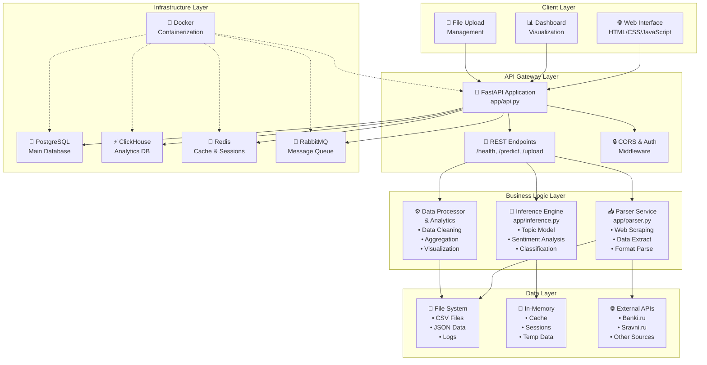

# Архитектура системы NaviMind

## Схема архитектуры системы



## Компоненты системы

### 1. Frontend (Клиентский слой)
- **Веб-интерфейс** - HTML5/CSS3/JavaScript
- **Дизайн** - в стиле Газпромбанка с темно-синей боковой панелью
- **Компоненты:**
  - Dashboard с визуализацией
  - Формы загрузки файлов
  - Интерактивные графики
  - Адаптивная верстка

### 2. API Gateway (Шлюз API)
- **FastAPI** - современный веб-фреймворк
- **Uvicorn** - ASGI сервер
- **Эндпоинты:**
  - `/health` - проверка состояния
  - `/predict` - анализ отзывов
  - `/upload-and-analyze` - загрузка и анализ файлов
  - `/analyze-dataset` - анализ dataset
  - `/topics` - список тем
  - `/feedback` - обратная связь

### 3. Business Logic (Бизнес-логика)

#### Parser Service (app/parser.py)
- **Web Scraping** - парсинг отзывов с банковских сайтов
- **Data Extraction** - извлечение структурированных данных
- **Format Parsing** - обработка различных форматов данных

#### Inference Engine (app/inference.py)
- **Topic Classification** - классификация по 20+ темам
- **Sentiment Analysis** - анализ тональности
- **Text Processing** - предобработка текста

#### Data Processor
- **Data Cleaning** - очистка и нормализация данных
- **Aggregation** - агрегация метрик
- **Visualization** - подготовка данных для визуализации

### 4. Data Layer (Слой данных)

#### File System
- **CSV Files** - основные данные отзывов
- **JSON Data** - конфигурации и результаты
- **Logs** - логирование событий

#### In-Memory Storage
- **Cache** - кэширование результатов
- **Sessions** - пользовательские сессии
- **Temp Data** - временные данные

#### External APIs
- **Banki.ru** - источник отзывов
- **Sravni.ru** - дополнительный источник
- **Other Sources** - расширение источников данных

### 5. Infrastructure (Инфраструктура)

#### Containerization
- **Docker** - контейнеризация приложения
- **Docker Compose** - оркестрация сервисов

#### Databases
- **PostgreSQL** - основная реляционная БД
- **ClickHouse** - аналитическая БД для больших данных
- **Redis** - кэш и управление сессиями
- **RabbitMQ** - очереди сообщений для асинхронной обработки

## Потоки данных

### 1. Парсинг отзывов
```
External APIs → Parser Service → Data Cleaning → Database
```

### 2. Анализ отзывов
```
User Input → API Gateway → Inference Engine → Results → Frontend
```

### 3. Загрузка файлов
```
File Upload → API Gateway → Data Processor → Database → Analysis
```

### 4. Визуализация
```
Database → Data Processor → Aggregated Data → Frontend Dashboard
```

## Технологический стек

### Backend
- **Python 3.11+** - основной язык
- **FastAPI** - веб-фреймворк
- **Uvicorn** - ASGI сервер
- **Pydantic** - валидация данных
- **Pandas** - обработка данных
- **BeautifulSoup** - парсинг HTML

### Frontend
- **HTML5** - структура
- **CSS3** - стилизация
- **JavaScript** - интерактивность
- **Responsive Design** - адаптивность

### Infrastructure
- **Docker** - контейнеризация
- **PostgreSQL** - основная БД
- **ClickHouse** - аналитическая БД
- **Redis** - кэширование
- **RabbitMQ** - очереди

### ML/AI
- **Scikit-learn** - классические ML алгоритмы
- **TensorFlow/PyTorch** - глубокое обучение
- **Transformers** - BERT модели
- **NLTK/spaCy** - обработка естественного языка

## Масштабируемость

### Горизонтальное масштабирование
- **Load Balancer** - распределение нагрузки
- **Multiple API Instances** - несколько экземпляров API
- **Database Sharding** - разделение данных

### Вертикальное масштабирование
- **Resource Optimization** - оптимизация ресурсов
- **Caching Strategy** - стратегия кэширования
- **Batch Processing** - пакетная обработка

## Безопасность

### API Security
- **CORS** - контроль доступа
- **Rate Limiting** - ограничение запросов
- **Input Validation** - валидация входных данных

### Data Security
- **Encryption** - шифрование данных
- **Access Control** - контроль доступа
- **Audit Logging** - аудит действий

## Мониторинг

### Metrics
- **Performance Metrics** - метрики производительности
- **Error Rates** - частота ошибок
- **Response Times** - время отклика

### Logging
- **Structured Logging** - структурированное логирование
- **Log Aggregation** - агрегация логов
- **Alerting** - система оповещений

---

*Документ обновлен: 2025-01-XX*